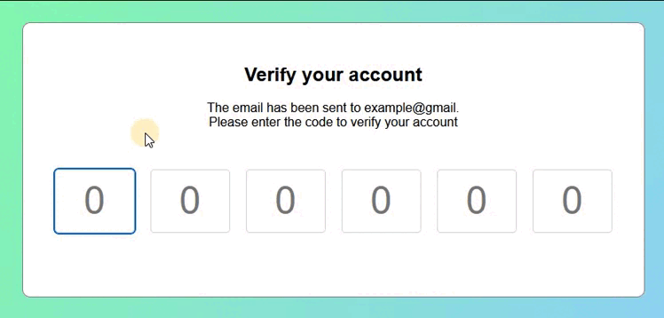

# 🛠 JAVASCRIPT Acc verification 

# 🔗 [Live Preview](https://632b51ad38f73a08aedf7991--tangerine-florentine-7d7a48.netlify.app/)

## Welcome! 👋

- In this project I learn how to make numbers appear consecutively in the highlighted boxes when typed and also disappear when erased. 

- This is a form for confirming your identity through receiving a set of numbers required to be typed into the form. It is used for websites such as Paypal and others

Thanks for checking out my JS learning projects.
